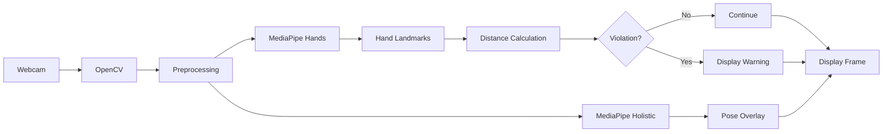
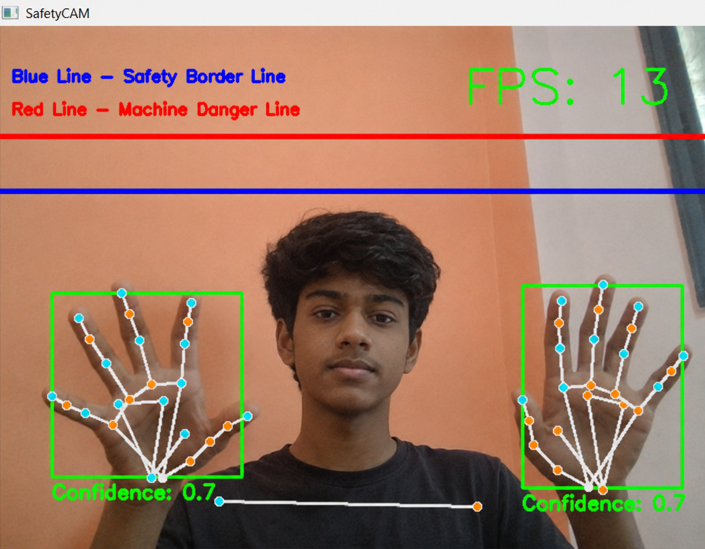
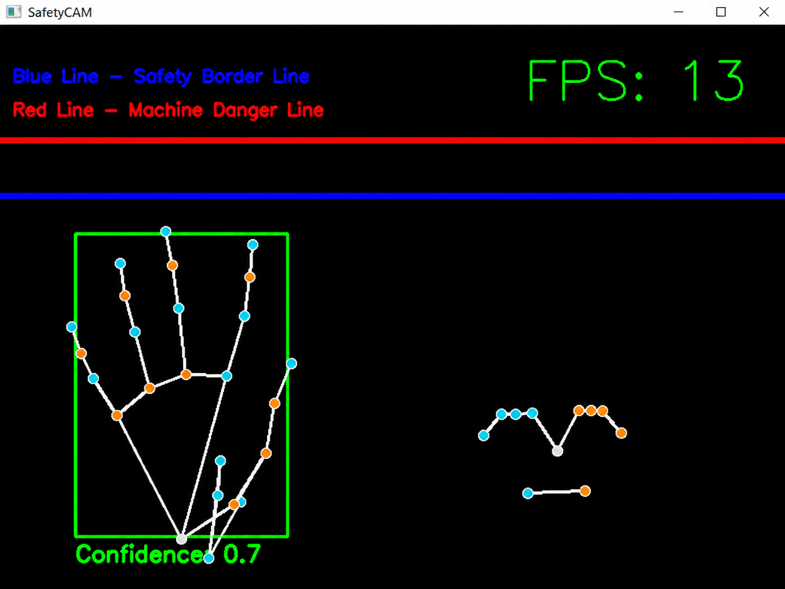
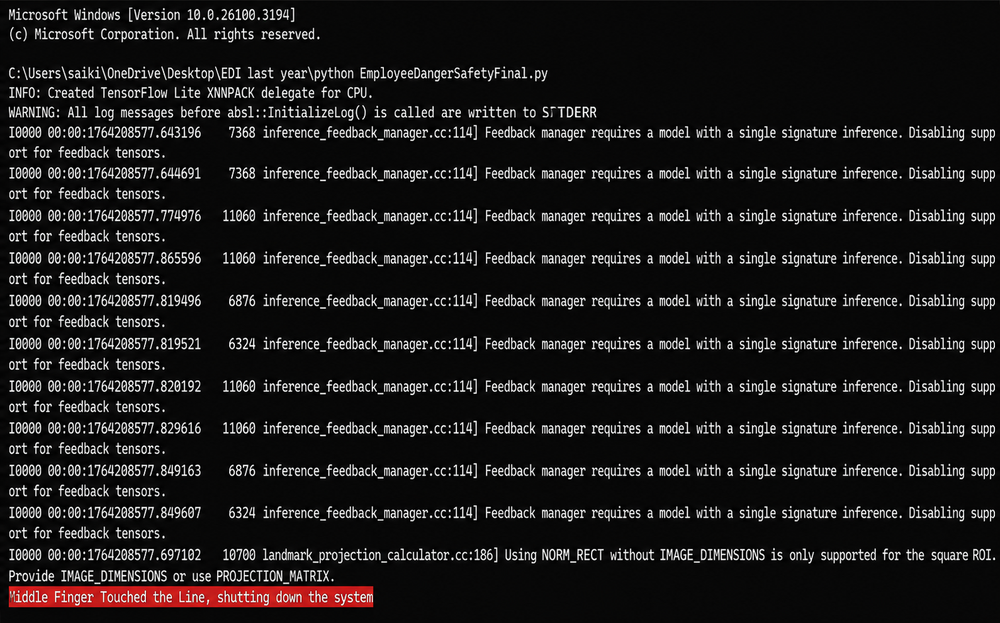

# Threat Security Software (TSS)

<p align="center">


</p>

## Real-Time Employee Danger and Safety Detection System

**Computer Vision | Industrial Safety | Real-Time Monitoring**

---

## Overview

Threat Security Software (TSS) is a real-time computer vision prototype developed to monitor employee hand movements near predefined machine safety boundaries. The system utilizes **OpenCV** for live video processing and **MediaPipe Hands** together with **MediaPipe Holistic** for accurate hand and pose landmark detection.

The application continuously analyzes live webcam frames, computes the distance between selected fingertip landmarks and a virtual danger boundary, and generates a warning when a safety violation is detected. By relying solely on camera-based monitoring, TSS demonstrates a cost-effective approach to industrial safety without requiring dedicated hardware sensors.

---

## Key Features

- Real-time webcam video processing
- Hand landmark detection using MediaPipe Hands
- Pose estimation using MediaPipe Holistic
- Fingertip proximity analysis against predefined safety boundaries
- Bounding box visualization for detected hands
- Real-time confidence score and FPS display
- Optional black mask mode for focused visualization

---

## System Workflow

```text
Webcam
   │
   ▼
Frame Capture (OpenCV)
   │
   ▼
Image Preprocessing
   │
   ▼
MediaPipe Hands & Holistic
   │
   ▼
Landmark Detection
   │
   ▼
Safety Boundary Mapping
   │
   ▼
Distance Calculation
   │
   ▼
Violation Detection
   ├───────────────┐
   │               │
   ▼               ▼
Display Warning   Continue Monitoring
   │               │
   └──────┬────────┘
          │
          ▼
Annotated Video Output
```

---

## System Architecture



---

## Technology Stack

| Category | Technology |
|----------|------------|
| Programming Language | Python 3.9 |
| Computer Vision | OpenCV |
| Pose Estimation | MediaPipe Hands, MediaPipe Holistic |
| Numerical Computing | NumPy, SciPy |
| Runtime | Webcam / Camera Feed |

---

## Project Structure

```text
Threat-Security-Software/
│
├── assets/
│   ├── console-output.png
│   ├── hand-detection.png
│   └── live-detection.png
│
├── SafetyGuard.py
├── README.md
└── requirements.txt
```
---

## Installation

### Clone the Repository

```bash
git clone https://github.com/Sahil-Jadhav95/Threat-Security-Software.git

cd Threat-Security-Software
```

### Create a Virtual Environment

```bash
python -m venv venv
```

### Activate the Virtual Environment

**Windows**

```bash
venv\Scripts\activate
```

**Linux / macOS**

```bash
source venv/bin/activate
```

### Install Dependencies

```bash
pip install -r requirements.txt
```

> **Note:** Python 3.9 is recommended for optimal MediaPipe compatibility.

---

## Usage

Run the application:

```bash
python EmployeeDangerSafetyFinal.py
```

During execution, the application will:

- Open the default webcam.
- Detect hand and pose landmarks in real time.
- Draw safety and machine boundary lines.
- Display hand bounding boxes.
- Show confidence scores and FPS.
- Print a warning message when a fingertip enters the danger zone.

### Keyboard Controls

| Key | Action |
|-----|--------|
| `Esc` | Exit the application |
| `M` | Toggle black mask mode |

---

## Sample Output

The application displays:

- Live webcam feed
- Hand landmarks
- Pose landmarks
- Hand bounding boxes
- Safety boundary line
- Machine danger line
- FPS counter
- Detection confidence
- Warning message when a safety violation occurs

| Normal Detection | Black Mask Mode | Console output |
|:----------------:|:----------------:|:---------------:|
|  |  |  |

---

## Applications

- Industrial safety monitoring
- Manufacturing plants
- Assembly line monitoring
- Machine operator safety
- Restricted-area monitoring

---

## Future Enhancements

- Multi-camera support
- Configurable danger zones
- Audio and visual alarm integration
- PLC and IoT integration
- AI-based posture classification
- Incident logging and analytics dashboard
- Web-based monitoring interface

---

## License

This project is developed for academic and research purposes.
